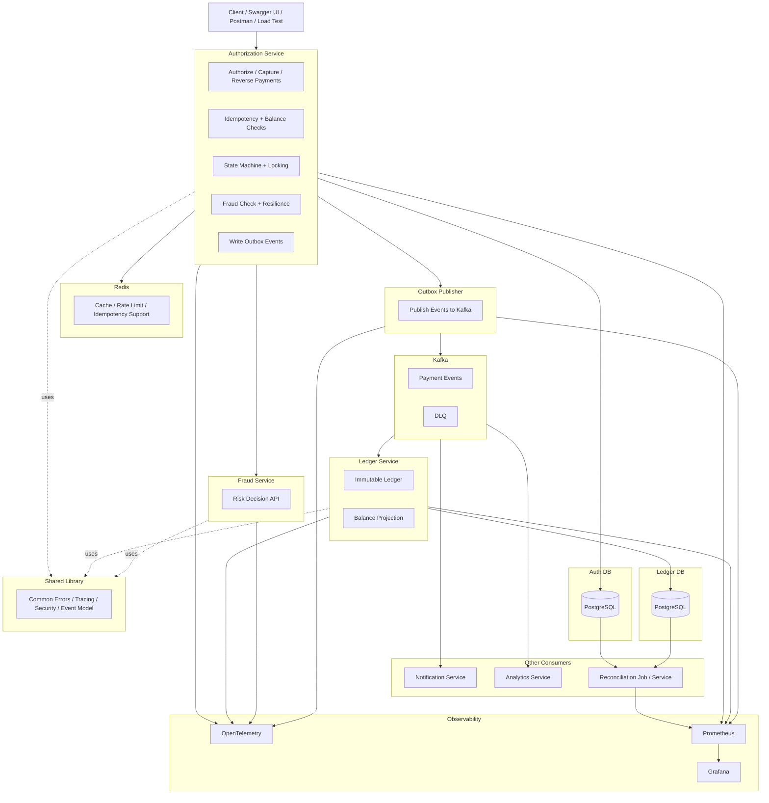

# Payment System MVP

A personal project demonstrating a simplified payment/authorisation system using Spring Boot, PostgreSQL, Kafka, and the
Outbox Pattern.

## Overview

This project models a basic payment authorisation flow with support for:

- account creation
- authorisation
- capture
- reverse
- event publishing through Kafka
- downstream ledger ingestion
- idempotent request handling

The project is intentionally scoped as an MVP for demonstration and learning purposes.

## Architecture

High-level documentation is available under [`docs/`](docs/).

Suggested diagrams:

- system overview
- service interaction diagram
- sequence diagrams for authorise / capture / reverse
- ER diagrams for Auth DB and Ledger DB

## Services

### Authorisation Service

Responsible for:

- account management
- authorisation lifecycle
- capture and reverse operations
- writing domain events
- publishing events through the outbox pattern

### Ledger Service

Responsible for:

- consuming Kafka events from Authorisation Service
- storing raw event history
- storing normalized ledger entries
- supporting audit-style read models

## Key Features

- Spring Boot microservices
- PostgreSQL persistence
- Kafka-based event-driven communication
- Outbox pattern for reliable event publishing
- Idempotency support for command requests
- Flyway database migrations
- MapStruct-based mapping example in Ledger

## Tech Stack

- Java
- Spring Boot
- Spring Data JPA
- Spring Kafka
- PostgreSQL
- Flyway
- MapStruct
- Maven

## Project Structure

```text
.
├── authorisation-service
├── ledger-service
└── docs
```

## Domain Scope

This MVP currently supports:

- full authorisation
- full capture only
- full reverse only

Not included yet:

- partial capture
- partial reverse
- refunds
- settlement
- multi-currency FX handling
- advanced reconciliation

## Key Workflow Summary

### Authorise

Creates an authorisation against an account and reserves funds.

### Capture

Captures a previously authorised amount in full.

### Reverse

Releases a previously authorised amount in full.

## Idempotency

Idempotency keys are used to make retrying requests safe.

Example:

- repeating the same capture request with the same idempotency key should return the previous successful response
- repeating with a different key after capture should return an error

## Eventing

The Authorisation Service writes domain events to an outbox table and publishes them to Kafka.

The Ledger Service consumes these events and stores:

- raw event payloads in `ledger_event_log`
- normalized rows in `ledger_entry`
- processed event ids in `processed_event`

## Database

Each service owns its own database schema.

See `docs/data/` for:

- ER diagrams
- main table descriptions
- migration notes

## API Documentation

See:

- `docs/api/auth-api.md`

This should include:

- request/response payloads
- status codes
- validation rules
- idempotency behavior

## Local Setup

## Prerequisites

- Java 21
- Maven
- Docker / Docker Compose
- PostgreSQL
- Kafka

## Run locally

### 1. Start infrastructure

Example:

```bash
docker compose up -d
```

### 2. Run database migrations

Flyway runs automatically on service startup.

### 3. Start Authorisation Service

```bash
cd authorisation-service
mvn spring-boot:run
```

### 4. Start Ledger Service

```bash
cd ledger-service
mvn spring-boot:run
```

## Testing

Run tests with:

```bash
mvn test
```

## Example Scenarios

Recommended demo flow:

1. create account
2. authorise payment
3. capture authorisation
4. reverse another authorisation
5. inspect emitted events
6. inspect ledger tables

## Design Notes

Key design decisions are documented in:

- `docs/decisions/`

Examples:

- why Kafka + outbox pattern
- why full capture/full reverse only in MVP
- why ledger stores both raw and normalized event data

## Future Improvements

Possible next steps:

- partial capture
- partial reverse
- refund flow
- optimistic locking improvements
- OpenAPI documentation
- containerized end-to-end local environment
- better observability and tracing

## Learning Goals

This project is intended to demonstrate:

- domain modeling
- idempotency handling
- state transition validation
- event-driven microservice communication
- transactional outbox pattern
- downstream event projection into ledger-style storage

## Author

Personal learning project by Shirong Quan.

# payment-platform

Fintech-inspired payment platform using Java, Spring Boot, PostgreSQL, Kafka, and Redis. Showcases real-time
authorisation, balance reservation, concurrency control, outbox-based event publishing, ledger updates, circuit
breaking, tracing, metrics, and load testing.

# simplified high level architecture



# Local server IP address

- auth service: 9000
- fraud service: 9010
- ledger service: 9020

- kafka ui: 9091
- kafka nodes: 9092, 9093, 9094

- postgres: 5434
- pgadmin: 5050


