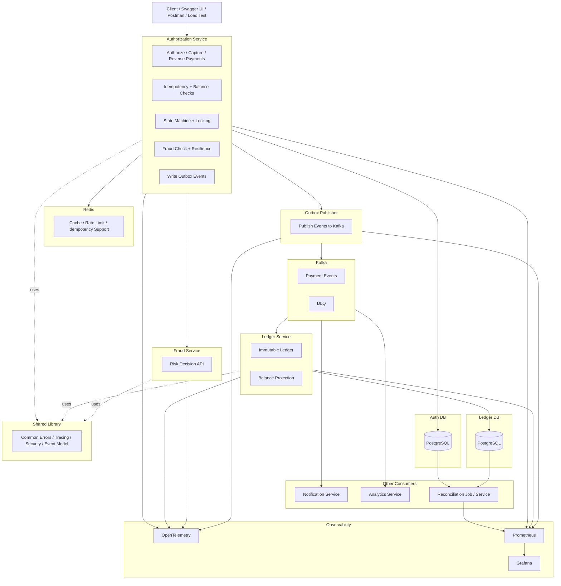

# payment-platform
Fintech-inspired payment platform using Java, Spring Boot, PostgreSQL, Kafka, and Redis. Showcases real-time authorisation, balance reservation, concurrency control, outbox-based event publishing, ledger updates, circuit breaking, tracing, metrics, and load testing.

# simplified high level architecture

# Local server IP address

- auth service: 9000
- fraud service: 9100
- ledger service: 9200

- kafka ui: 9091
- kafka nodes: 9092, 9093, 9094

- postgres: 5434
- pgadmin: 5050

