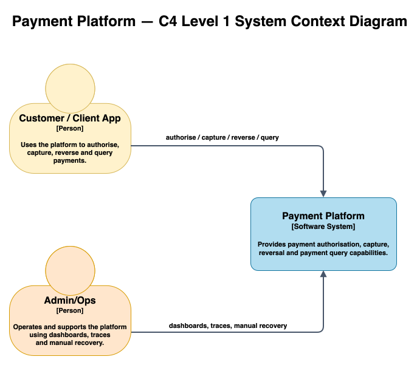
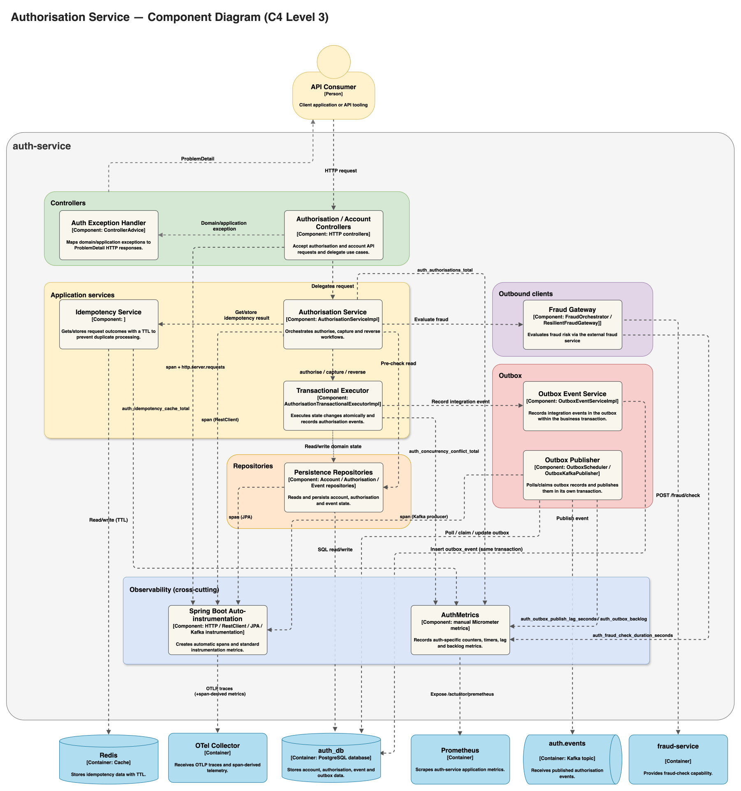
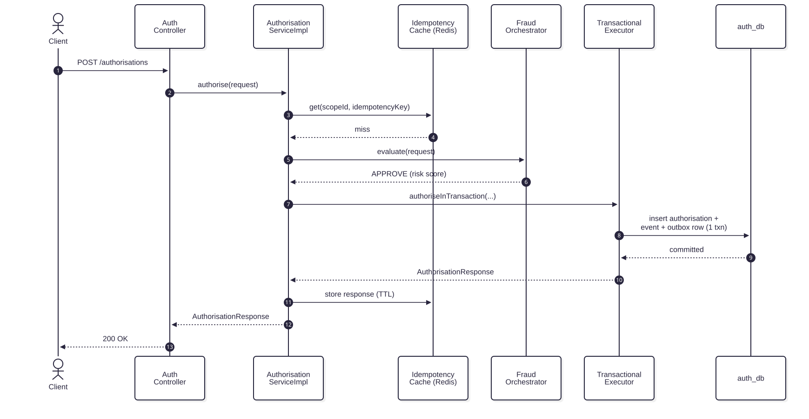

# Architecture Docs Index

C4-style architecture documentation for the Payment Platform, from broadest zoom to most detailed.

## Diagrams (C4)

### System Context (L1)

[System Context (L1)](./system-context.md) — the platform as a single external-facing box, its actors
(Customer/Client App, Admin/Ops), and their major interactions. No internal services are shown at this level.

  

*Figure 6: System Context (C4 Level 1) — external actors/systems and the Payment Platform system boundary.
Click the diagram to open the full-size SVG.*

### Containers (L2)

[Containers (L2)](./containers.md) — zooms into that box: the deployable runtime units (`auth-service`,
`fraud-service`, `ledger-service`), platform infrastructure (Postgres, Redis, Kafka), and the observability stack
(OTel Collector, Tempo, Prometheus, Grafana), with their responsibilities, tech stack, owned data, and sync/async
interactions.

  

*Figure 7: Containers (C4 Level 2) — auth-service, fraud-service, ledger-service, platform infrastructure
(Postgres, Redis, Kafka), and the observability stack. Click the diagram to open the full-size SVG.*

### Components — auth-service (L3)

[Components — auth-service (L3)](./components-auth-service.md) — internals of `auth-service` only: component
diagram (controllers, application services, domain, repositories, outbox, outbound clients), a mini "authorise
happy path" sequence, a responsibility table, and boundary notes (transaction boundaries, idempotency/concurrency
points, external calls).

  

*Figure 8: Components — auth-service (C4 Level 3) — controllers, application services, domain, repositories,
outbox, and outbound clients. Click the diagram to open the full-size SVG.*

  

*Figure 9: Sequence — authorise happy path (mini) across `auth-service` components. Click the diagram to open
the full-size SVG.*

## Security

### Trust Boundaries

[Trust Boundaries](./trust-boundaries.md) — public API / internal service / data / messaging boundaries and what
each enforces at the application level today. Infrastructure-level hardening (TLS, network policy, broker/cache
auth, etc.) and planned application-level controls (e.g. authentication) are linked out to the
[roadmap](../roadmap.md) rather than assessed here.

  

*Figure 10: Trust boundaries — public API, internal service, data, and messaging boundaries. Click the diagram
to open the full-size SVG.*

## Related

- [Flow Diagrams](../flows/README.md) — detailed sequence diagrams per use case (authorise/capture/reverse,
  idempotency, event publishing/consuming).
- [Data Model](../data/data-model.md) — table-level detail per service database.
- [ADRs](../decisions/README.md) — the "why" behind the decisions referenced throughout these docs.
