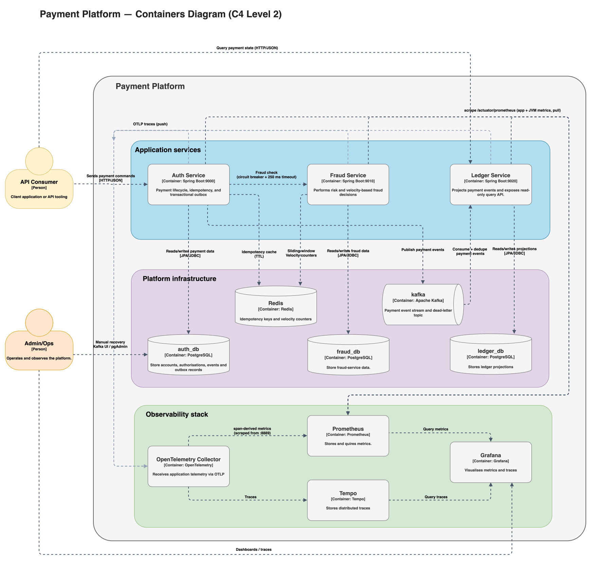

# Containers (C4 Level 2)

## Table of Contents

- [Diagram](#diagram)
- [Runtime units](#runtime-units)
    - [Application services (internal)](#application-services-internal)
    - [Shared library (not independently deployed)](#shared-library-not-independently-deployed)
    - [Platform infrastructure (internal)](#platform-infrastructure-internal)
    - [Observability Stack (internal, separate sub-boundary)](#observability-stack-internal-separate-sub-boundary)
    - [Admin/dev tooling (internal, ops-facing)](#admindev-tooling-internal-ops-facing)
- [Key interactions](#key-interactions)
    - [Synchronous (REST, request/response)](#synchronous-rest-requestresponse)
    - [Asynchronous (Kafka, at-least-once)](#asynchronous-kafka-at-least-once)
    - [Data access](#data-access)
    - [Telemetry (traces vs. metrics)](#telemetry-traces-vs-metrics)

## Diagram

  

*Figure 7: Containers (C4 Level 2) — auth-service, fraud-service, ledger-service, platform infrastructure
(Postgres, Redis, Kafka), and the observability stack. Click the diagram to open the full-size SVG.*

This zooms into the [System Context](./system-context.md) and shows the main deployable/runtime units that make
up the Payment Platform. All of these — the three application services, Kafka/Redis/PostgreSQL, and the
observability stack — are internal to the platform's single deployment/environment today (no separate team or
release boundary between them); the observability stack is still grouped as its own visual sub-boundary since
it's a distinct telemetry concern from the payment data path, not because it's operated separately.

## Runtime units

### Application services (internal)

| Container                        | Responsibility                                                                                                                                                                                                                                                                  | Tech stack                                                                                           | Owned data                                                                                                                                       |
|----------------------------------|---------------------------------------------------------------------------------------------------------------------------------------------------------------------------------------------------------------------------------------------------------------------------------|------------------------------------------------------------------------------------------------------|--------------------------------------------------------------------------------------------------------------------------------------------------|
| **auth-service** (port `9000`)   | Account management; authorise/capture/reverse lifecycle; idempotency enforcement; optimistic-locking concurrency control; calls fraud-service; writes the transactional outbox.                                                                                                 | Java 21, Spring Boot 4, Spring Data JPA, Spring Kafka (producer), Resilience4j, Flyway, Redis client | `auth_db` (PostgreSQL): `account`, `authorisation`, `authorisation_event`, `outbox_event`. Also owns keys in Redis (idempotency response cache). |
| **fraud-service** (port `9010`)  | Synchronous risk evaluation for a proposed authorisation (velocity + amount-deviation rules); returns approve/decline (+ risk score, optional account-lock recommendation) to auth-service. Not exposed externally.                                                             | Java 21, Spring Boot 4, Spring Data JPA, Flyway, Redis (Lua scripts for sliding-window counters)     | `fraud_db` (PostgreSQL): `fraud_evaluation`. Also owns keys in Redis (`fraud:sw:*` velocity counters, amount-baseline cache).                    |
| **ledger-service** (port `9020`) | Consumes `auth-service`'s domain events from Kafka, deduplicates them, and projects them into raw + normalized ledger storage; exposes read-only query endpoints. Never called synchronously by another service — Kafka is its only inbound trigger besides its own REST reads. | Java 21, Spring Boot 4, Spring Kafka (consumer), Spring Data JPA, Flyway, MapStruct                  | `ledger_db` (PostgreSQL): `ledger_event_log`, `ledger_entry`, `processed_event`.                                                                 |

### Shared library (not independently deployed)

| Container             | Responsibility                                                                                                                                                                                                                                                                         | Tech stack                                            |
|-----------------------|----------------------------------------------------------------------------------------------------------------------------------------------------------------------------------------------------------------------------------------------------------------------------------------|-------------------------------------------------------|
| **shared-spring-lib** | Common cross-cutting concerns compiled into all three services: RFC 7807 error model, correlation-id propagation (filter + `RestClient` interceptor), idempotency request hashing, currency-code validation. See [ADR 0009](../decisions/0009-shared-spring-lib-for-cross-cutting.md). | Java 21 library (Maven module), no standalone runtime |

### Platform infrastructure (internal)

| Container                                       | Responsibility                                                                                                                                                                                                                                                                                                                                                   | Tech / image                                 | Used by                                            |
|-------------------------------------------------|------------------------------------------------------------------------------------------------------------------------------------------------------------------------------------------------------------------------------------------------------------------------------------------------------------------------------------------------------------------|----------------------------------------------|----------------------------------------------------|
| **postgres**                                    | Single PostgreSQL instance hosting three logically separate databases (`auth_db`, `fraud_db`, `ledger_db`), created via `infra/postgres/init/01-create-databases.sql`. Each service only ever touches its own database — there is no cross-service schema access.                                                                                                | `postgres:16`, port `5432`                   | auth-service, fraud-service, ledger-service        |
| **redis**                                       | Shared low-latency store for two distinct purposes: auth-service's idempotent-response cache (keyed per operation, TTL-based) and fraud-service's sliding-window velocity/rate-limit counters (Lua-script atomic ops). See [ADR 0006](../decisions/0006-redis-sliding-window-rate-limit.md) / [ADR 0007](../decisions/0007-idempotency-store-and-key-policy.md). | `redis:8.6-alpine`, port `6379`              | auth-service, fraud-service                        |
| **kafka** (3-node KRaft cluster: `kafka-1/2/3`) | Durable, replicated event log for the `auth.events` topic (replication factor 3, min ISR 2) and its dead-letter topic. Decouples auth-service (producer) from ledger-service (consumer).                                                                                                                                                                         | `apache/kafka:4.3.0`, ports `9092/9094/9095` | auth-service (producer), ledger-service (consumer) |

### Observability Stack (internal, separate sub-boundary)

| Container          | Responsibility                                                                                                                                                                                                                                                                                                                          | Tech / image                       | Used by                                                        |
|--------------------|-----------------------------------------------------------------------------------------------------------------------------------------------------------------------------------------------------------------------------------------------------------------------------------------------------------------------------------------|------------------------------------|----------------------------------------------------------------|
| **OTel Collector** | Receives OTLP **traces** from all three services (gRPC/HTTP push) and forwards them to Tempo; derives RED-style span metrics (rate/error/duration) from those traces via the `spanmetrics` connector, exposed for scraping. Does **not** carry application/business metrics — those bypass the Collector entirely (see Prometheus row). | `otel-collector-contrib` `0.112.0` | auth-service, fraud-service, ledger-service (traces, push)     |
| **Tempo**          | Trace storage/query backend behind Grafana's trace views.                                                                                                                                                                                                                                                                               | `2.6.0`                            | OTel Collector (writes), Grafana (reads)                       |
| **Prometheus**     | Two independent scrape paths: (1) each service's own `/actuator/prometheus` endpoint, for app/JVM/business metrics (e.g. `auth_authorisations_total`), and (2) the OTel Collector's `:8889` span-metrics endpoint, for RED metrics derived from traces. Both are pull-based; neither path depends on the other.                         | `v3.5.4`                           | Grafana (reads); all three services + OTel Collector (scraped) |
| **Grafana**        | Dashboards for business metrics, JVM/HTTP internals, Redis, and Kafka health; also the trace-search UI (via the Tempo datasource).                                                                                                                                                                                                      | `11.6`                             | Admin/Ops                                                      |

Not on the request path — a service failure/latency spike in the observability stack does not affect
authorise/capture/reverse traffic; it only degrades what Ops can *see*.

### Admin/dev tooling (internal, ops-facing)

| Container        | Responsibility                                                 | Tech / image                        | Used by  |
|------------------|----------------------------------------------------------------|-------------------------------------|----------|
| **pgAdmin**      | Human-facing inspection tool for PostgreSQL.                   | `dpage/pgadmin4:9.15` (`5050`)      | Ops only |
| **RedisInsight** | Human-facing inspection tool for Redis.                        | `redis/redisinsight:3.8.0` (`5540`) | Ops only |
| **Kafka UI**     | Human-facing inspection tool for Kafka topics/consumer groups. | `kafbat/kafka-ui:v1.5.0` (`9091`)   | Ops only |

## Key interactions

### Synchronous (REST, request/response)

- `Client -> auth-service`: `POST /accounts`, `POST /authorisations`, `POST /authorisations/{id}/captures`,
  `POST /authorisations/{id}/reversals`, account/authorisation reads.
- `auth-service -> fraud-service`: `POST /fraud/check`, wrapped in a Resilience4j circuit breaker + 250ms time
  limiter (`ResilientFraudGateway`); on timeout/circuit-open, auth-service falls back to an `unavailable`
  decision rather than blocking indefinitely.
- `Client -> ledger-service`: read-only `GET /authorisations/{id}`, `GET /accounts/{id}/events` — no writes.
- No service calls `auth-service` back — it is the only inbound entry point that mutates state.

### Asynchronous (Kafka, at-least-once)

- `auth-service -> Kafka (auth.events)`: outbox rows (`AUTHORISED` / `CAPTURED` / `REVERSED`) are polled and
  published by `OutboxScheduler` / `OutboxKafkaPublisher`, with `eventId`, `correlationId`, and `traceparent`
  headers for downstream dedup/tracing.
- `Kafka (auth.events) -> ledger-service`: `LedgerKafkaConsumer` consumes and routes by event type; non-retryable
  failures are redirected to `auth.events.ledger.dlt` (dead-letter topic) after 3 retries with 2s backoff (see
  [ADR 0004](../decisions/0004-use-event-and-dlt-topics.md)).

### Data access

- Each service connects **only** to its own database; there is no shared-schema access between services —
  cross-service data sharing happens exclusively through the Kafka event stream (see
  [ADR 0003](../decisions/0003-ledger-raw-and-normalized-events.md)).
- Redis is the only store touched by two different services (auth-service and fraud-service), but each uses a
  disjoint key namespace (`{operation}:idempotency:*` vs `fraud:sw:*` / amount-baseline keys) — there is no
  shared key space or read/write coupling between them.

### Telemetry (traces vs. metrics)

These are **two independent paths**, not one — a common point of confusion when reading the diagram at a glance:

- **Traces (push):** each service's Spring Boot auto-instrumentation exports spans via **OTLP** to the OTel
  Collector, which forwards them to Tempo. The Collector's `spanmetrics` connector also derives RED-style
  (rate/error/duration) metrics *from those spans* and exposes them on its own `:8889` endpoint.
- **Application/business metrics (pull):** each service separately exposes its own Micrometer registry (JVM,
  HTTP server timers, and hand-written business counters/timers such as `auth_authorisations_total`) at
  `/actuator/prometheus`. Prometheus scrapes this endpoint **directly on each service** — this path never goes
  through the OTel Collector.
- Prometheus therefore has two scrape targets per environment: every service's `/actuator/prometheus`, and the
  OTel Collector's `:8889` span-metrics endpoint. Both are pull-based and independent of each other; losing the
  Collector does not stop app-metric scraping, and vice versa.

