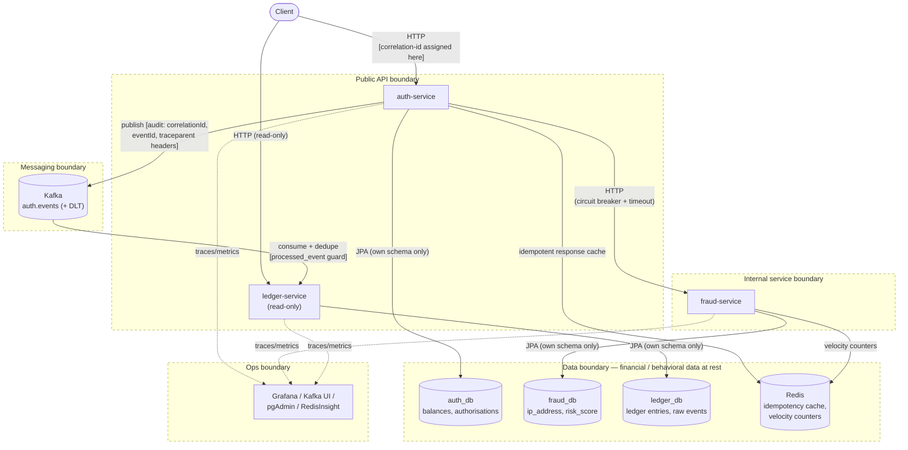

# Trust Boundaries

This document describes the trust zones the Payment Platform's *application layer* crosses today — the
boundaries between the public API, internal service calls, data stores, and messaging — and what each boundary
enforces at the application level. It intentionally does not assess the system against a production security
standard: infrastructure-level concerns (TLS, reverse proxy/WAF, network policy, broker/cache authentication,
etc.) are a deployment-environment decision, not an application-implementation one, and are tracked in the
[roadmap's Production Considerations](../roadmap.md#6-production-considerations) instead. Where an
application-level control (e.g. authentication) is planned rather than implemented yet, this doc says so and
links to the relevant [roadmap Next Steps](../roadmap.md#5-next-steps-prioritized) item.

## Boundaries in the platform

### 1) Public API boundary (Client -> auth-service / ledger-service)

- **Surface:** `auth-service` (`:9000`) and `ledger-service` (`:9020`) accept inbound HTTP directly from callers.
- **What's enforced today:** bean validation rejects malformed input (`400`); idempotency and authorisation-state
  rules reject conflicting/duplicate requests (`409` — see [ADR 0005](../decisions/0005-idempotency-and-concurrency.md)
  / [ADR 0007](../decisions/0007-idempotency-store-and-key-policy.md)); every authorise request is evaluated for
  fraud risk before funds are reserved.
- **Planned:** request authentication/authorization (Spring Security + JWT, customer vs. admin role separation) —
  see [roadmap Next Steps #1](../roadmap.md#5-next-steps-prioritized). An API gateway for centralized
  authn/authz enforcement and rate limiting is also planned — see
  [roadmap Next Steps #4](../roadmap.md#5-next-steps-prioritized).

### 2) Internal service boundary (auth-service -> fraud-service)

- **Surface:** `auth-service` calls `fraud-service` (`:9010`) over HTTP within the same deployment network.
- **What's enforced today:** the call is wrapped in a Resilience4j circuit breaker + time limiter for
  availability (see [ADR 0008](../decisions/0008-resilience4j-circuit-breaker-policy.md)); `fraud-service` is
  deployed as an internal-only service, not intended to be reachable by external callers.
- **Planned:** service-to-service authentication (e.g. mTLS or a signed internal-service token) is an
  infrastructure-level hardening step tracked in the
  [roadmap's Production Considerations](../roadmap.md#6-production-considerations).

### 3) Data boundary (financial / behavioral data at rest)

- **Surface:** three PostgreSQL databases (`auth_db`, `fraud_db`, `ledger_db`) on a shared Postgres instance,
  plus Redis.
- **Data held per service:**
    - `account`: `available_balance`, `reserved_balance` (financial)
    - `authorisation` / `authorisation_event`: `amount`, `currency_code`, `merchant_reference` (financial)
    - `fraud_evaluation`: `amount`, `ip_address` (behavioral), `risk_score`, `decision`
    - `ledger_entry` / `ledger_event_log`: `amount`, projected `balance`, raw event payloads (financial, audit)
    - Redis: cached idempotent HTTP response bodies (TTL-bounded) and velocity counters (ephemeral)
- **What's enforced today:** schema-level isolation per service — each service only ever queries its own
  database (see [Containers](./containers.md)); no service has cross-schema access to another's data.
- **Planned:** encryption at rest/in transit, per-service least-privilege database roles, secret rotation, and
  network policy restricting database/cache reachability to the owning service are infrastructure-level
  hardening steps tracked in the [roadmap's Production Considerations](../roadmap.md#6-production-considerations).

### 4) Messaging boundary (Kafka: auth-service -> ledger-service)

- **Surface:** `auth.events` (+ `auth.events.ledger.dlt`) topic on a 3-broker KRaft cluster.
- **What's enforced today:** delivery-reliability controls — `acks=all`, idempotent producer,
  `read_committed` consumer isolation, retry + dead-letter routing (see
  [ADR 0004](../decisions/0004-use-event-and-dlt-topics.md)) — plus consumer-side deduplication via
  `processed_event` (see [ADR 0003](../decisions/0003-ledger-raw-and-normalized-events.md)).
- **Planned:** broker authentication/transport encryption (SASL/mTLS) and topic-level ACLs are
  infrastructure-level hardening steps tracked in the
  [roadmap's Production Considerations](../roadmap.md#6-production-considerations).

## AuthN / AuthZ across boundaries

| Boundary | AuthN today | AuthZ today | Plan |
|---|---|---|---|
| Public API | None | None | Spring Security + JWT with role separation — [roadmap Next Steps #1](../roadmap.md#5-next-steps-prioritized) |
| auth-service -> fraud-service | Internal-only deployment (network-scoped) | None | Service-to-service auth (mTLS/signed token) — infrastructure hardening, see [Production Considerations](../roadmap.md#6-production-considerations) |

Database, Kafka, and Redis network-level authentication (per-service DB roles, SASL/mTLS, `requirepass`/ACLs),
plus SSO/RBAC for ops tooling (Grafana, Kafka UI, pgAdmin, RedisInsight), are infrastructure/deployment concerns
covered by the [roadmap's Production Considerations](../roadmap.md#6-production-considerations) rather than
this document.

## Sensitive data handling

- **Correlation / audit trail:** every request gets a correlation id (`CorrelationIdFilter` in
  `shared-spring-lib`) propagated across HTTP calls and into Kafka headers, plus a W3C `traceparent` for
  distributed tracing. Logs include `[traceId,spanId] [correlationId]`, giving a consistent audit trail across
  services and async boundaries today.
- **Idempotency keys:** idempotency keys are client-supplied opaque strings, cached in Redis alongside the
  response they produced (TTL-bounded, default 24h) — treat these as sensitive-adjacent since the cached value
  contains the same financial data as the original response.
- **Account data isolation:** balances and reserved amounts live only in `auth_db`; no other service reads them
  directly — `fraud-service` only sees the amount/currency of the specific request being evaluated, never the
  account balance; `ledger-service` only sees what was published on `auth.events` (event history), never the
  live authoritative balance.
- **Fraud signal isolation:** `ip_address` and computed `risk_score`/`decision` are stored in `fraud_db` only;
  they are not echoed back into `auth_db` or the ledger — auth-service only receives the approve/decline outcome
  (+ optional lock recommendation), not the raw fraud evidence.
- **Transport/at-rest encryption:** planned as infrastructure-layer work appropriate to the target deployment
  environment — see the [roadmap's Production Considerations](../roadmap.md#6-production-considerations).

## Diagram

Trust boundaries as a simplified data-flow diagram. Dashed boxes mark the application-level trust zones described
above.

Source: [`trust-boundaries.mmd`](./trust-boundaries.mmd)

## Related

- [System Context](./system-context.md)
- [Containers](./containers.md)
- [Components — auth-service](./components-auth-service.md)
- [Roadmap — Next Steps](../roadmap.md#5-next-steps-prioritized)
- [Roadmap — Production Considerations](../roadmap.md#6-production-considerations)
- [ADR 0006 — Redis sliding-window rate limiting](../decisions/0006-redis-sliding-window-rate-limit.md)
- [ADR 0007 — Idempotency store and key policy](../decisions/0007-idempotency-store-and-key-policy.md)
- [API Overview — Security](../api/overview.md#security)

