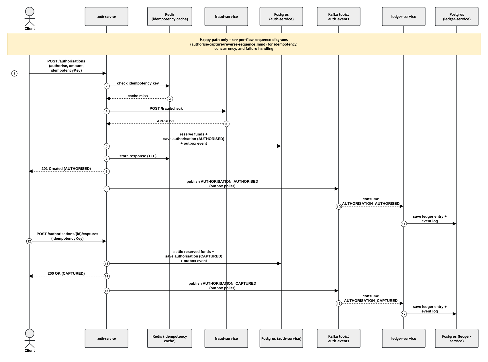
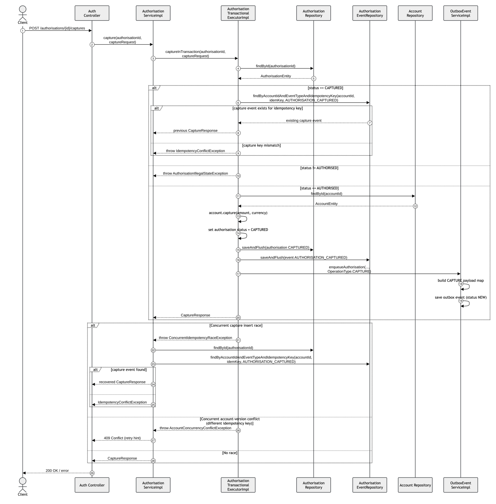
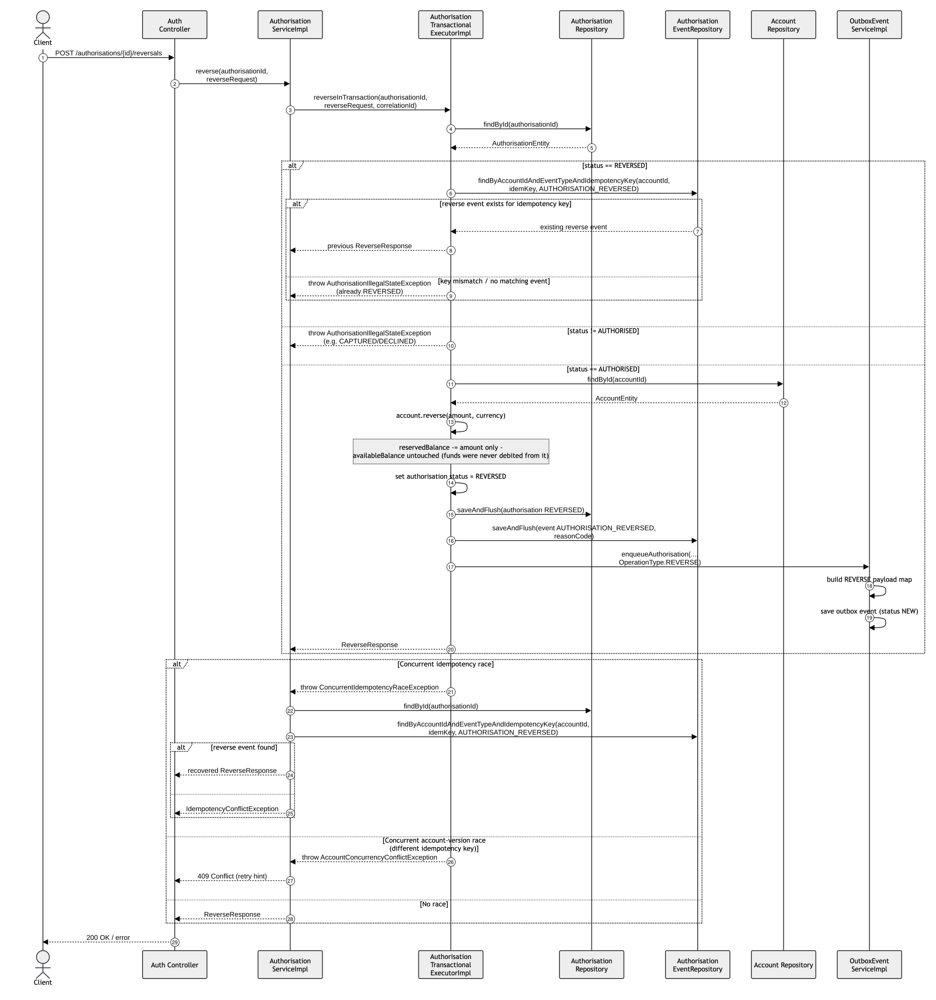
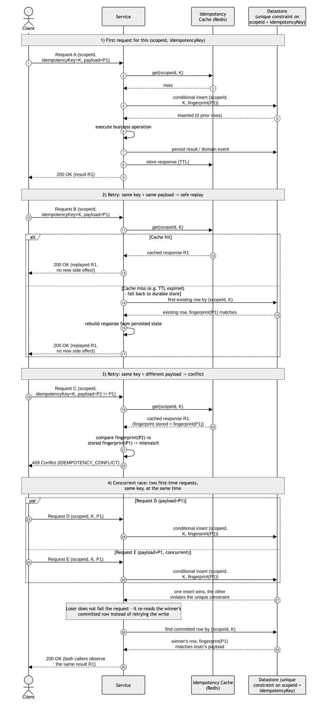
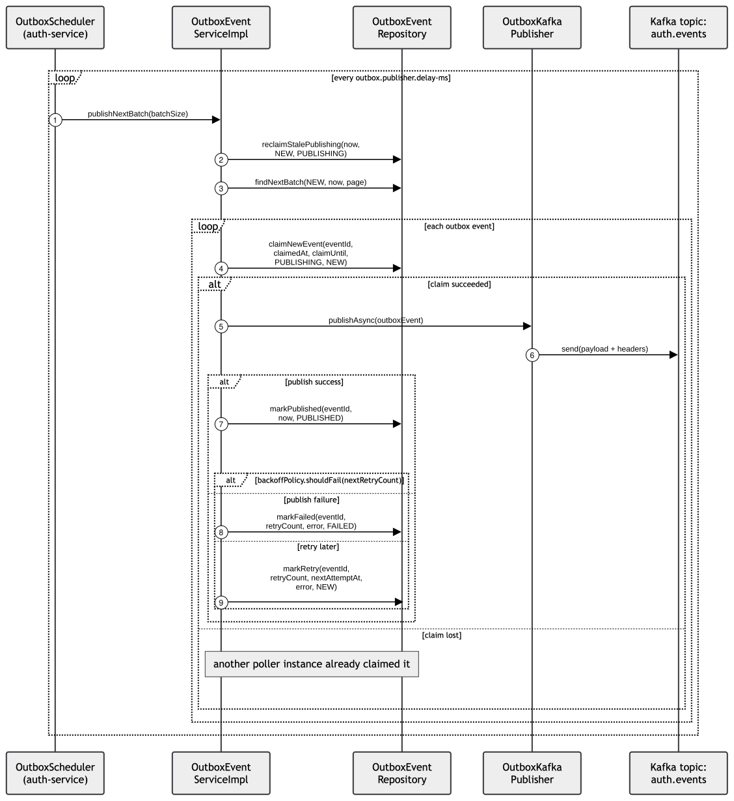
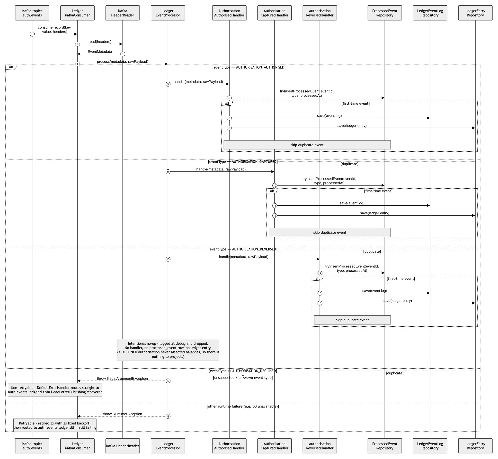
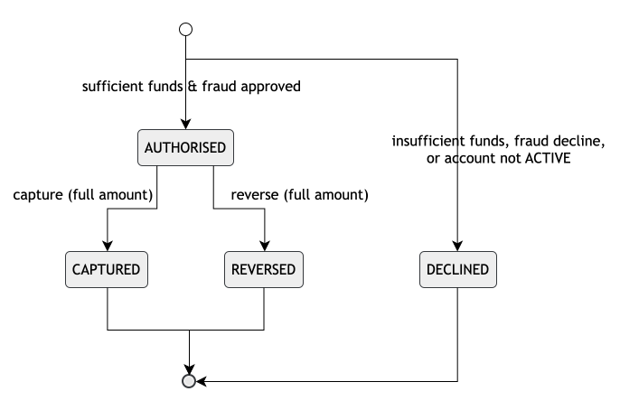
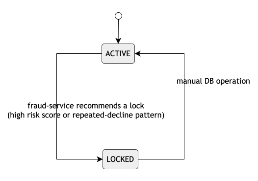

# Flow Diagrams

## Table of Contents

- [Documents in this folder](#documents-in-this-folder)
    - [Payment Lifecycle](./payment-lifecycle.md)
    - [Failure Scenarios](./failure-scenarios.md)
    - [Outbox Backlog Recovery](./outbox-backlog-recovery.md)
- [Diagram Index](#diagram-index)
    - [Payment Lifecycle Happy Path](#payment-lifecycle-happy-path)
    - [Authorise Sequence](#authorise-sequence)
    - [Capture Sequence](#capture-sequence)
    - [Reverse Sequence](#reverse-sequence)
    - [Idempotency Generic Sequence](#idempotency-generic-sequence)
    - [Event Publishing Sequence](#event-publishing-sequence)
    - [Event Consuming Sequence](#event-consuming-sequence)
    - [Outbox Backlog Recovery Flow](#outbox-backlog-recovery-flow)
    - [Payment Lifecycle State / Account Lock State](#payment-lifecycle-state--account-lock-state)
- [Quick Guidance](#quick-guidance)
- [MVP Scope Note](#mvp-scope-note)

This folder contains sequence diagrams and companion documentation for key runtime flows across
`auth-service`, `fraud-service`, and `ledger-service`.

## Documents in this folder

- [Payment Lifecycle](./payment-lifecycle.md)  
  Canonical business flow (`auth -> reserve -> capture -> reverse`), state transitions, and event/data mapping.

- [Failure Scenarios](./failure-scenarios.md)  
  Expected behavior for duplicates, timeouts, publish/consume failures, and invalid transitions.

- [Outbox Backlog Recovery](./outbox-backlog-recovery.md)  
  How to detect, triage, and recover a growing auth-service outbox backlog or a terminally `FAILED`
  outbox row, including the manual replay procedure.

---

## Diagram Index

This is the canonical place to view each diagram and see what it covers. Other docs in this folder
link back here instead of restating the same summary.

### Payment Lifecycle Happy Path

  

Simplified, end-to-end happy-path overview (also used in the root `README`). Use for a quick,
high-level mental model before diving into the more detailed per-step sequence diagrams below.

Covers:

- authorise -> reserve funds
- capture -> settle reserved funds
- ledger projection of the resulting events

### Authorise Sequence

  

Use when working on **initial authorisation** behavior.

Covers:

- request handling
- idempotency checks
- account reserve logic
- event persistence
- outbox enqueue

### Capture Sequence

  

Use when working on **capture** behavior.

Covers:

- legal-state validation
- idempotent replay/conflict behavior
- reserved balance capture
- capture outbox event creation

### Reverse Sequence

  

Use when working on **reverse** behavior.

Covers:

- legal-state validation (`AUTHORISED` required; already-`REVERSED` triggers idempotent replay)
- idempotent replay/conflict behavior (same pattern as capture)
- reserved-balance release (`reservedBalance` only; `availableBalance` untouched)
- reverse outbox event creation

### Idempotency Generic Sequence

  

Use when explaining or designing **idempotency behavior generically**, independent of any single
endpoint. Applies to every idempotency-keyed mutating endpoint across the platform (auth-service's
authorise/capture/reverse and fraud-service's `/fraud/check`).

Covers:

- first request for a given `(scopeId, idempotencyKey)`
- retry with the same key + same payload -> safe cached/durable replay (no duplicate side effect)
- retry with the same key + a different payload -> `409 IDEMPOTENCY_CONFLICT`
- concurrent first-time requests racing on the same key -> loser recovers the winner's committed
  response instead of failing or duplicating the operation

### Event Publishing Sequence

  

Use for **auth-service outbox publishing** concerns.

Covers:

- polling
- claiming
- retry/fail handling
- Kafka publish path

### Event Consuming Sequence

  

Use for **ledger-service consume/projection** concerns.

Covers:

- header parsing
- routing
- deduplication
- projection writes

### Outbox Backlog Recovery Flow

  

Use when an outbox backlog is growing or rows are landing in `FAILED`, and you need the
decision logic for how to respond. Companion flowchart for
[Outbox Backlog Recovery](./outbox-backlog-recovery.md).

Covers:

- **detect** — backlog/lag/failed-attempt metrics vs. querying the outbox table directly
- **triage** — distinguishing a self-healing stale claim from a genuinely exhausted retry budget,
  and classifying the root cause (transient infra vs. bad data)
- **retry** — the automatic claim → publish → backoff loop
- **DLQ/manual replay** — the operator-driven requeue path for terminal `FAILED` rows

### Payment Lifecycle State / Account Lock State

  

  

Use alongside [Payment Lifecycle](./payment-lifecycle.md#lifecycle-at-a-glance) for the
authorisation and account-level state diagrams at a glance (a closely related, slightly more
detailed pair of the same two diagrams also lives in
[Payment State Machine](../domain/state-machine.md#diagram)).

---

## Quick Guidance

- For API/business logic changes, start with:
    - [Authorise Sequence](#authorise-sequence)
    - [Capture Sequence](#capture-sequence)

- For understanding idempotency replay/conflict rules generically (not tied to one endpoint), use:
    - [Idempotency Generic Sequence](#idempotency-generic-sequence)

- For producer-side delivery reliability/debugging, use:
    - [Event Publishing Sequence](#event-publishing-sequence)

- For consumer-side duplicate handling or projection discrepancies, use:
    - [Event Consuming Sequence](#event-consuming-sequence)

- For diagnosing/recovering an outbox backlog or a terminally `FAILED` outbox row, use:
    - `outbox-backlog-recovery.md` + [Outbox Backlog Recovery Flow](#outbox-backlog-recovery-flow)

- Use [Reverse Sequence](#reverse-sequence) for the reverse (release) flow — implemented, not a placeholder.

---

## MVP Scope Note

These flow docs describe the core flows implemented and demonstrable in this MVP. See
[Payment Platform MVP Progress](../roadmap.md) for planned enhancements beyond this scope.
